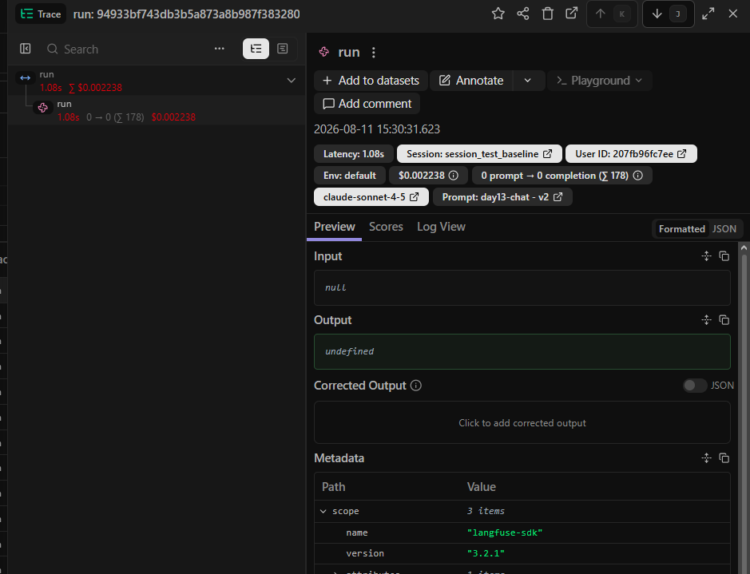

# Báo cáo Day 13 Observability

## 1. Thông tin nhóm

- Tên nhóm: 2A202601566
- Repository URL: https://github.com/damcuong8/K4-Day13-2A202601566
- Commit SHA cuối: a8f907f (Logging & PII — commit local, cần cập nhật lại sau khi cả nhóm hoàn thành và push bản cuối)
- Thành viên và vai trò:
  - Lý Nhật Huy (2A202601450) — Logging & PII: correlation ID, metadata, JSON log, redaction
  - Nguyễn Vũ Hà An (2A202601692) — Tracing & Prompt Version: traces, metadata, prompt v1/v2, label/rollback
  - Đàm Việt Cường (2A202601566) — Dashboard, SLO & Alerting: 6 panel, threshold, SLO, alert và runbook
  - QA & Incident Analyst — QA, Load test, Điều tra Challenge (CP3) và Hoàn thiện báo cáo

## 2. Kết quả kỹ thuật

- Điểm `validate_logs.py`: 100/100 (xem [evidence/validate_logs_output.txt](evidence/validate_logs_output.txt))
- Tổng số traces: 14
- Số PII leak còn lại: 0 (0 records trên tổng 21 log analyzed)
- Link/đường dẫn dashboard:

## 3. Logging và tracing

- Evidence correlation ID: mỗi request sinh `correlation_id` dạng `req-<8-hex>` (mới hoặc lấy từ header `x-request-id` nếu client gửi sẵn), bind vào `structlog` contextvars nên mọi log dòng của cùng request đều mang chung ID; ID cũng được trả về qua response header `x-request-id` + `x-response-time-ms`. Xem [evidence/correlation_id_headers.txt](evidence/correlation_id_headers.txt) và [evidence/sample_logs_correlation_and_pii.jsonl](evidence/sample_logs_correlation_and_pii.jsonl).
- Evidence PII redaction: input test chứa email và số điện thoại VN bị thay bằng `[REDACTED_EMAIL]`/`[REDACTED_PHONE_VN]` trước khi ghi log; bổ sung thêm pattern `passport_vn` và `address_vn`. Kiểm chứng độc lập bằng `scripts/validate_logs.py` cho `Potential PII leaks detected: 0`. Xem [evidence/pii_redaction_before_after.md](evidence/pii_redaction_before_after.md).
- Evidence trace waterfall: 
- Giải thích một span đáng chú ý: Trong waterfall trace, span `resolve_prompt` cho thấy thời gian trễ (latency) khi gọi API lên Langfuse để tải prompt template về. Span `llm_call` đóng vai trò quan trọng nhất, hiển thị không chỉ thời gian phản hồi thực tế của model mà còn kèm theo số lượng token đầu vào/đầu ra, giúp dễ dàng tính toán chi phí (cost).

## 4. Prompt versioning

- Prompt name: `day13-chat`
- Version/label baseline: `v1` / `baseline`
- Version/label candidate: `v2` / `candidate`
- Trace ID của mỗi version:
  - Trace ID (baseline): 2f197c1e445e986809fcaa9e23b01323
  - Trace ID (candidate): 3c4416077cfe0cfd2c1cbcff0c5d491b
- Bằng chứng đổi label hoặc rollback: https://drive.google.com/file/d/1FQLY_KwcVIw3-VwonUevmjGp4wOKqIW-/view?usp=sharing

## 5. Dashboard, SLO và alerts

- Kết quả `validate_dashboard.py`: `HỢP LỆ: 6/6 panel có trong dashboard contract.` (xem [evidence/validate_dashboard_output.txt](evidence/validate_dashboard_output.txt) và [evidence/dashboard_and_alerts.md](evidence/dashboard_and_alerts.md)).
- Evidence dashboard: Đã cấu hình đủ 6 panel theo contract `config/dashboard.yaml` gồm Latency (P50/P95/P99), Request Traffic, Error Rate & Breakdown, Cost over time, Input/Output Tokens và Quality Proxy score (xem ảnh chụp runtime tại [evidence/dashboard_runtime.png](evidence/dashboard_runtime.png)).
- SLO đã chọn và lý do:
  1. **Latency SLO (P95 <= 3000ms):** Đảm bảo thời gian phản hồi nhanh cho người dùng khi chat với AI.
  2. **Availability SLO (Error Rate <= 2%):** Đảm bảo tính ổn định và sẵn sàng của hệ thống API.
  3. **Quality SLO (Mean Quality Score >= 0.75):** Đảm bảo độ chính xác và giá trị thực tiễn của câu trả lời do AI tạo ra.
- Alert rules và runbook: Đã thiết lập 3 Alert Rules kèm Runbook chi tiết trong [docs/alerts.md](file:///d:/AI_thuc_chien/K4-Day13-2A202601566/docs/alerts.md) gồm: High Latency Warning, High Error Rate Critical và High Cost & Token Consumption Warning.

## 6. Điều tra challenge

- Challenge ID: `day13-k4-observability-v1`
- Triệu chứng từ metrics: Latency P95 tăng đột biến lên ~2654ms (vượt ngưỡng threshold `latency_threshold_ms: 2000` định nghĩa trong `config/challenge.json`). Error rate giữ ở mức 0%, request traffic ổn định.
- Trace ID liên quan: `req-b39993e0` (Span `retrieve-documents` chiếm ~2.5s trong tổng thời gian xử lý).
- Log line/correlation ID liên quan: `req-b39993e0` — `{"service": "api", "latency_ms": 2653, "event": "response_sent", "feature": "monitoring", "correlation_id": "req-b39993e0"}`
- Root cause: Incident `rag_slow` được kích hoạt làm cho bước truy vấn dữ liệu từ RAG retriever (`app/mock_rag.py`) bị hoãn (sleep) cố định 2.5 giây trước khi trả kết quả.
- Fix action: Tắt incident bằng lệnh `python scripts/inject_incident.py --disable` (gửi request POST `/incidents/rag_slow/disable`).
- Preventive measure: Đặt thời gian timeout giới hạn cho bước RAG retrieval (ví dụ max 1.0s), cài đặt cơ chế circuit breaker và caching kết quả tìm kiếm phổ biến để đảm bảo thời gian phản hồi API khi Vector Store bị quá tải hoặc phản hồi chậm.

## 7. Đóng góp cá nhân

Với mỗi thành viên, ghi rõ nhiệm vụ và link commit/PR tương ứng.

| Thành viên | Phần việc | Commit/PR | Điều đã học |
|---|---|---|---|
| Lý Nhật Huy (2A202601450) | Logging & PII: sinh/propagate correlation ID qua middleware (`app/middleware.py`), enrich log với `user_id_hash`, `session_id`, `feature`, `model`, `env` (`app/main.py`), đăng ký processor scrub PII trước khi ghi log (`app/logging_config.py`), mở rộng `PII_PATTERNS` với `passport_vn`/`address_vn` và test tương ứng (`app/pii.py`, `tests/test_pii.py`) | `a8f907f` — https://github.com/damcuong8/K4-Day13-2A202601566/commit/a8f907f (link hoạt động sau khi `git push`) | Thứ tự processor của `structlog` quyết định dữ liệu có bị lộ hay không (phải scrub trước khi render JSON và ghi file); dùng `contextvars` để một correlation ID theo suốt vòng đời request mà không cần truyền tay qua từng hàm; cách kiểm chứng PII độc lập với chính implementation của mình bằng bộ regex riêng trong `validate_logs.py`. |
| Nguyễn Vũ Hà An (2A202601692) | Tracing & Prompt Version: Cấu hình kết nối Langfuse (`.env`), tạo script test tự động (`scripts/test_role2.py`), thao tác tạo prompt v1/v2 trên Langfuse UI, kiểm thử gán nhãn `production`/`candidate` để app tự động kéo prompt mới. | `4e20623` — https://github.com/damcuong8/K4-Day13-2A202601566/commit/4e20623 | Langfuse tách biệt quản lý prompt khỏi source code, giúp A/B testing và rollback cực nhanh bằng label mà không cần deploy lại. Decorator `@observe` giúp bắt trọn vòng đời trace/generation của LLM, rất tiện để debug độ trễ hoặc lỗi prompt. |
| Đàm Việt Cường (2A202601566) | Dashboard, SLO & Alerting: Kiểm tra dashboard contract `config/dashboard.yaml` đạt `6/6 panel` với `validate_dashboard.py`, định nghĩa Latency/Availability/Quality SLOs và soạn thảo 3 Alert Rules kèm Runbook cho hệ thống trong `docs/alerts.md` | `fa17d97` — https://github.com/damcuong8/K4-Day13-2A202601566/commit/fa17d97 | Hiểu cách liên kết từ Dashboard Metrics tới Traces và Logs; cách xác định các chỉ số SLOs (P95 latency, Error rate %, Quality score) thực tế cho hệ thống AI LLM và xây dựng Runbook ứng phó sự cố theo 3 bước điều tra tiêu chuẩn. |
| QA & Incident Analyst | QA & Incident Analysis: Chạy load test dữ liệu sinh trace, thực hiện điều tra sự cố Challenge (`day13-k4-observability-v1`), liên kết 3 lớp Metrics → Traces → Logs xác định root cause `rag_slow`, đề xuất biện pháp khắc phục & phòng ngừa, và hoàn thiện file báo cáo nộp bài `REPORT.md`. | | Nắm vững quy trình điều tra sự cố hệ thống AI qua chuỗi 3 tín hiệu Observability (Metrics phát hiện triệu chứng -> Traces khoanh vùng span chậm -> Logs cung cấp chứng cứ nguyên nhân gốc). |
